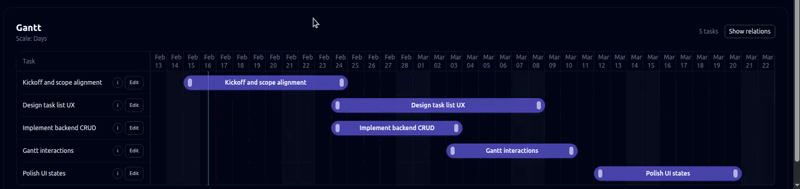

<div align="center">

<p align="center">
    
</p>

<h1 align="center">Open Source Decision-Driven Planning Engine</h1>

<p align="center">
  <a href="https://lineo-labs.github.io/lineo-pm/getting-started/installation">Getting Started</a> ·
  <a href="https://lineo-labs.github.io/lineo-pm/concepts/decision-engine">Concepts</a> ·
  <a href="https://lineo-labs.github.io/lineo-pm/api-reference/backend">API Reference</a>
</p>

<p align="center">
  
  
</p>



</div>

---

## What is Lineo-PM?

**Lineo-PM** is not a task tracker. It is a **decision-driven planning engine** built around dependency propagation, scenario planning, and Monte Carlo risk simulation.

Most project tools are built to record and report on the current state of work. Lineo-PM is built to help you **evaluate decisions before you make them**.

> Move an activity. Watch the dependencies cascade. Know instantly what changed.

Lineo models your project schedule as a live dependency graph. Every change you make — dragging a task, adjusting a duration, switching a scenario — propagates through the plan in real time, so you always see the downstream impact before committing. This allows you to explore alternatives, stress-test your plan, and communicate with stakeholders in a way that static task trackers can't support.

→ Read more: [Decision Engine](https://lineo-labs.github.io/lineo-pm/concepts/decision-engine)

---

## Core Capabilities

### Cascading Dependency Propagation
Move one task and all downstream activities adjust automatically. The engine traverses the full dependency graph instantly, flagging constraint violations as they appear.

### Scenario Engine
Create persistent alternative timelines, modify them independently, compare against your baseline, and promote the best plan to production.  
→ [Scenarios](https://lineo-labs.github.io/lineo-pm/concepts/scenarios)

### Monte Carlo Simulation
Run probabilistic risk analysis. Get slip probability, per-task critical index, delay distribution histograms, and P50–P99 percentile estimates across thousands of simulated runs.  
→ [Monte Carlo](https://lineo-labs.github.io/lineo-pm/concepts/monte-carlo)

### Risk-Adjusted Planning
Automatically generate a risk-buffered scenario at a target confidence level (P80, P90, P99). The engine computes per-task buffers from the critical index and duration uncertainty, explains every shift, and saves the result as a new scenario.  
→ [Risk-Adjusted Scenarios](https://lineo-labs.github.io/lineo-pm/concepts/risk-adjusted)

### Milestone & Narrative Updates
Anchor key delivery points on the timeline and log decision-driven update entries that build an audit trail of your project's story.

---

## Quick Start

### Prerequisites
- Docker and Docker Compose

### 1. Clone the repository

```bash
git clone https://github.com/lineo-labs/lineo-pm.git
cd lineo-pm
```

### 2. Start development containers

```bash
docker compose -f docker-compose.dev.yml up -d --build
```

### 3. Access the application

| Service | URL |
|---|---|
| Frontend | [http://localhost:5173](http://localhost:5173) |
| Backend API docs | [http://localhost:8000/docs](http://localhost:8000/docs) |

For full installation instructions → [Getting Started](https://lineo-labs.github.io/lineo-pm/getting-started/installation)

---

## Documentation

The full documentation is available at **[lineo-labs.github.io/lineo-pm](https://lineo-labs.github.io/lineo-pm/)**.

| Section | Description |
|---|---|
| [Getting Started](https://lineo-labs.github.io/lineo-pm/getting-started/installation) | Installation, configuration, first run |
| [Concepts](https://lineo-labs.github.io/lineo-pm/concepts/decision-engine) | Decision engine, scenarios, Monte Carlo, risk adjustment |
| [Architecture](https://lineo-labs.github.io/lineo-pm/architecture/system-overview) | System overview, backend, frontend, Gantt engine |
| [API Reference](https://lineo-labs.github.io/lineo-pm/api-reference/backend) | Full REST API reference |
| [Contributing](https://lineo-labs.github.io/lineo-pm/contributing) | Development workflow and guidelines |

---

## Technology Stack

| Layer | Technologies |
|---|---|
| **Backend** | FastAPI, PostgreSQL (async SQLAlchemy), Celery |
| **Frontend** | React, TypeScript, Tailwind CSS, Vite |
| **Infrastructure** | Docker, Docker Compose |

---

## Roadmap

- [x] Interactive Gantt with cascading dependency propagation
- [x] Scenario engine with baseline comparison
- [x] Monte Carlo simulation with per-task risk analysis
- [x] Risk-adjusted scenario generation
- [x] Cross-project Gantt view
- [ ] User authentication & permissions
- [ ] AI assistant — auto-suggest durations, natural language queries, predictive analytics

> Priorities may shift based on feedback. See [open issues](https://github.com/lineo-labs/lineo-pm/issues) for the current backlog.

---

## Contributing

Contributions are welcome. Please read the [contributing guide](https://lineo-labs.github.io/lineo-pm/contributing) before opening a pull request.

**Branch model:**
- `main` — stable, production-ready
- `dev` — active development (target for all PRs)

**Workflow:**
1. Branch off `dev` (`feature/...` or `bugfix/...`)
2. Open a pull request against `dev` with a focused, descriptive change
3. After review and merge into `dev`, changes are periodically promoted to `main`
---

## License

Licensed under the [Apache License 2.0](LICENSE).
